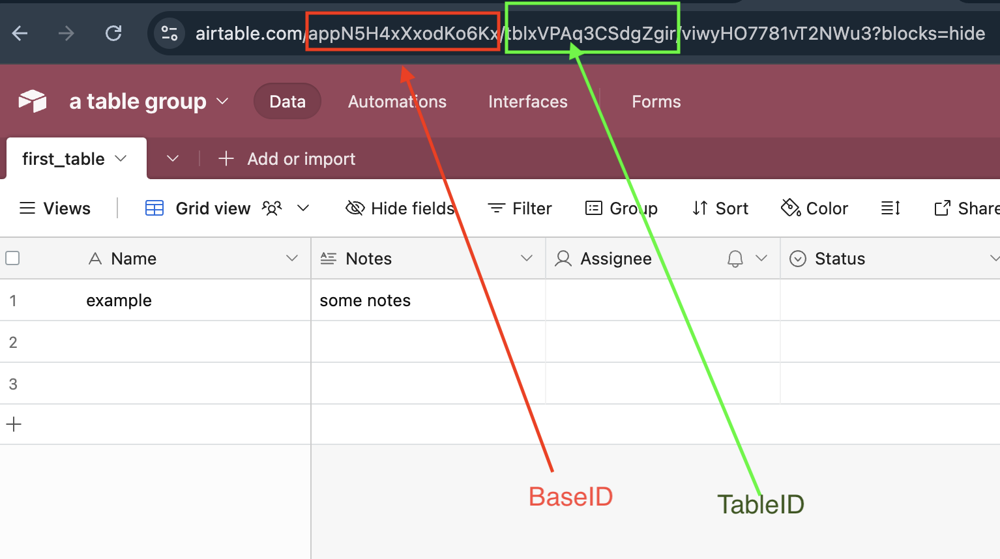

# Airtable

[Airtable](https://www.airtable.com) is an easy-to-use online platform for creating and sharing relational databases.

The Airtable Wrapper allows you to read data from your Airtable bases/tables within your Postgres database.

## Preparation

Before you can query Airtable, you need to enable the Wrappers extension and store your credentials in Postgres.

### Enable Wrappers

Make sure the `wrappers` extension is installed on your database:

```sql
create extension if not exists wrappers with schema extensions;
```

### Enable the Airtable Wrapper

Enable the `airtable_wrapper` FDW:

```sql
create foreign data wrapper airtable_wrapper
  handler airtable_fdw_handler
  validator airtable_fdw_validator;
```

### Store your credentials (optional)

By default, Postgres stores FDW credentials inside `pg_catalog.pg_foreign_server` in plain text. Anyone with access to this table will be able to view these credentials. Wrappers is designed to work with [Vault](https://supabase.com/docs/guides/database/vault), which provides an additional level of security for storing credentials. We recommend using Vault to store your credentials.

Get your token from [Airtable's developer portal](https://airtable.com/create/tokens).

```sql
-- Save your Airtable API key in Vault and retrieve the created `key_id`
select vault.create_secret(
  '<Airtable API Key or PAT>', -- Airtable API key or Personal Access Token (PAT)
  'airtable',
  'Airtable API key for Wrappers'
);
```

### Connecting to Airtable

We need to provide Postgres with the credentials to connect to Airtable, and any additional options. We can do this using the `create server` command:

=== "With Vault"

    ```sql
    create server airtable_server
      foreign data wrapper airtable_wrapper
      options (
        api_key_id '<key_ID>' -- The Key ID from above.
      );
    ```

=== "Without Vault"

    ```sql
    create server airtable_server
      foreign data wrapper airtable_wrapper
      options (
        api_key '<your_api_key>'
      );
    ```

### Create a schema

We recommend creating a schema to hold all the foreign tables:

```sql
create schema if not exists airtable;
```

## Entities

The Airtable Wrapper supports data reads from the Airtable API.

### Records

The Airtable Wrapper supports data reads from Airtable's [Records](https://airtable.com/developers/web/api/list-records) endpoint (_read only_).

#### Operations

| Object  | Select | Insert | Update | Delete | Truncate |
| ------- | :----: | :----: | :----: | :----: | :------: |
| Records |   ✅    |   ❌    |   ❌    |   ❌    |    ❌     |

#### Usage

Get your base ID and table ID from your table's URL.



!!! note

    Foreign table names must be lowercase in PostgreSQL, regardless of capitalization in Airtable.

```sql
create foreign table airtable.my_foreign_table (
  message text
  -- other fields
)
server airtable_server
options (
  base_id 'appXXXX',
  table_id 'tblXXXX'
);
```

#### Notes

- The table requires both `base_id` and `table_id` options
- Optional `view_id` can be specified to query a specific view

## Supported Data Types

The Airtable Wrapper maps Airtable field types to PostgreSQL data types. Use this reference when defining your foreign table columns.

### Text Fields

| Airtable Field Type | PostgreSQL Type | Example | Notes |
| ------------------- | --------------- | ------- | ----- |
| Single line text    | `text`          | `name text` | No length limit in PostgreSQL |
| Long text           | `text`          | `description text` | Preserves line breaks |
| Email               | `text`          | `email text` | Validate in application if needed |
| URL                 | `text`          | `website text` | Store as plain text |
| Phone number        | `text`          | `phone text` | Preserves formatting |

### Numeric Fields

| Airtable Field Type | PostgreSQL Type | Example | Notes |
| ------------------- | --------------- | ------- | ----- |
| Number              | `numeric`, `integer`, `bigint`, `real`, `double precision` | `quantity integer` | Choose based on precision needs |
| Currency            | `numeric`       | `price numeric(19,4)` | Use precision for currency calculations |
| Percent             | `numeric`       | `rate numeric(5,4)` | Stored as decimal (e.g., 75% = 0.75) |
| Autonumber          | `bigint`        | `row_num bigint` | Auto-generated, read-only |

### Selection Fields

| Airtable Field Type | PostgreSQL Type | Example | Notes |
| ------------------- | --------------- | ------- | ----- |
| Single select       | `text`          | `status text` | Returns option name as string |
| Multiple select     | `jsonb`         | `tags jsonb` | Returns JSON array of option names |
| Checkbox            | `boolean`       | `is_active boolean` | `true` when checked |

### Date/Time Fields

| Airtable Field Type    | PostgreSQL Type | Example | Notes |
| ---------------------- | --------------- | ------- | ----- |
| Date                   | `date`          | `due_date date` | ISO 8601 format |
| Created time           | `timestamp`     | `created_at timestamp` | Auto-generated by Airtable |
| Last modified time     | `timestamp`     | `updated_at timestamp` | Auto-updated by Airtable |

### User/Collaborator Fields

| Airtable Field Type | PostgreSQL Type | Example | Notes |
| ------------------- | --------------- | ------- | ----- |
| Created by          | `jsonb`         | `created_by jsonb` | Contains `{id, email, name}` |
| Last modified by    | `jsonb`         | `modified_by jsonb` | Contains `{id, email, name}` |
| User                | `jsonb`         | `assigned_to jsonb` | Contains user object |

### Complex Fields

| Airtable Field Type    | PostgreSQL Type | Example | Notes |
| ---------------------- | --------------- | ------- | ----- |
| Multiple record links  | `jsonb`         | `related_records jsonb` | Array of linked record IDs |
| Attachments            | `jsonb`         | `files jsonb` | Array of attachment objects with url, filename, size |
| Lookup                 | `jsonb`         | `lookup_values jsonb` | Values from linked records |
| Rollup                 | Varies          | `total numeric` | Match to rollup result type |
| Formula                | Varies          | `computed text` | Match to formula result type |

## Column Name Mapping

PostgreSQL and Airtable handle column names differently. Understanding these differences is essential for successful data mapping.

### Understanding Case Sensitivity

PostgreSQL identifiers are **case-insensitive by default** and are folded to lowercase. Airtable field names **preserve case** exactly as entered.

| PostgreSQL Column | Airtable Field | Match? |
| ----------------- | -------------- | ------ |
| `name`            | `name`         | ✅ Yes |
| `name`            | `Name`         | ❌ No - Airtable field is uppercase |
| `firstname`       | `FirstName`    | ❌ No - Case mismatch |
| `first_name`      | `First Name`   | ❌ No - Space in Airtable name |

### Using the column_name Option

When your Airtable field name doesn't match PostgreSQL's lowercase convention, use the `column_name` option to explicitly map columns:

```sql
create foreign table airtable.customers (
  -- Simple lowercase match - no option needed
  id text,

  -- Airtable field has a space: "First Name"
  first_name text options (column_name 'First Name'),

  -- Airtable field is mixed case: "LastName"
  last_name text options (column_name 'LastName'),

  -- Airtable field has special characters: "Price ($)"
  price_usd numeric options (column_name 'Price ($)'),

  -- Airtable field is all caps: "SKU"
  sku text options (column_name 'SKU')
)
server airtable_server
options (
  base_id 'appXXXX',
  table_id 'tblXXXX'
);
```

### Best Practices

1. **Always check your Airtable field names** - Open your Airtable base and note the exact spelling and capitalization
2. **Use `column_name` liberally** - When in doubt, explicitly map the column to avoid silent NULL values
3. **Matching is by name, not position** - You can define columns in any order and omit columns you don't need
4. **Use snake_case for PostgreSQL** - Map Airtable's "First Name" to PostgreSQL's `first_name` for SQL convenience

## Working with Array and JSON Fields

Several Airtable field types return JSONB data in PostgreSQL. Here's how to work with them effectively.

### Multiple Select Fields

Multiple select fields are returned as JSON arrays of strings.

```sql
-- Create foreign table with multiple select field
create foreign table airtable.products (
  id text,
  name text,
  tags jsonb options (column_name 'Tags')
)
server airtable_server
options (
  base_id 'appXXXX',
  table_id 'tblXXXX'
);

-- Example data in tags: ["Electronics", "Sale", "Featured"]

-- Query: Find products with a specific tag
select name, tags
from airtable.products
where tags ? 'Sale';

-- Query: Find products with any of several tags
select name, tags
from airtable.products
where tags ?| array['Electronics', 'Furniture'];

-- Query: Extract tags as text array for processing
select name, jsonb_array_elements_text(tags) as tag
from airtable.products;
```

### Linked Records

Linked record fields return JSON arrays of record IDs.

```sql
-- Create foreign table with linked records
create foreign table airtable.orders (
  id text,
  order_number text options (column_name 'Order Number'),
  customer_ids jsonb options (column_name 'Customer')
)
server airtable_server
options (
  base_id 'appXXXX',
  table_id 'tblXXXX'
);

-- Example data in customer_ids: ["recABC123", "recDEF456"]

-- Query: Find orders linked to a specific customer
select order_number, customer_ids
from airtable.orders
where customer_ids ? 'recABC123';

-- Query: Count linked records
select order_number, jsonb_array_length(customer_ids) as customer_count
from airtable.orders;
```

### Attachments

Attachment fields return JSON arrays containing file metadata.

```sql
-- Create foreign table with attachments
create foreign table airtable.documents (
  id text,
  title text,
  files jsonb options (column_name 'Attachments')
)
server airtable_server
options (
  base_id 'appXXXX',
  table_id 'tblXXXX'
);

-- Example data in files:
-- [{"id": "attXXX", "url": "https://...", "filename": "doc.pdf", "size": 12345, "type": "application/pdf"}]

-- Query: Get first attachment URL
select title, files->0->>'url' as first_file_url
from airtable.documents;

-- Query: Get all attachment filenames
select title, jsonb_path_query(files, '$[*].filename') as filename
from airtable.documents;

-- Query: Find documents with PDF attachments
select title
from airtable.documents
where exists (
  select 1 from jsonb_array_elements(files) as f
  where f->>'type' = 'application/pdf'
);
```

### User/Collaborator Fields

User fields return JSON objects with user details.

```sql
-- Create foreign table with user fields
create foreign table airtable.tasks (
  id text,
  task_name text options (column_name 'Task Name'),
  assigned_to jsonb options (column_name 'Assigned To'),
  created_by jsonb options (column_name 'Created By')
)
server airtable_server
options (
  base_id 'appXXXX',
  table_id 'tblXXXX'
);

-- Example data in assigned_to: {"id": "usrXXX", "email": "user@example.com", "name": "John Doe"}

-- Query: Get assignee email
select task_name, assigned_to->>'email' as assignee_email
from airtable.tasks;

-- Query: Find tasks assigned to specific user
select task_name
from airtable.tasks
where assigned_to->>'email' = 'john@example.com';
```

## Query Pushdown Support

This FDW doesn't support query pushdown. All filtering is performed locally in PostgreSQL after fetching data from Airtable.

!!! warning "Performance Consideration"

    For large Airtable bases, consider using Airtable Views to pre-filter data, or use the optional `view_id` parameter to limit the records fetched.

## Limitations

This section describes important limitations and considerations when using this FDW:

### Read-Only Access

The Airtable Wrapper provides **read-only access**. Write operations are not supported:

- ✅ `SELECT` - Fully supported
- ❌ `INSERT` - Not supported
- ❌ `UPDATE` - Not supported
- ❌ `DELETE` - Not supported
- ❌ `TRUNCATE` - Not supported

To modify Airtable data, use the [Airtable API](https://airtable.com/developers/web/api/introduction) directly.

### Other Limitations

- **No query pushdown** - All filtering happens locally after data is fetched
- **Large datasets** - Performance may degrade with large result sets due to full data transfer
- **Computed fields** - Formula, rollup, and lookup fields work but require matching the output type
- **Views** - Must be pre-configured in Airtable before referencing
- **Block features** - Airtable Blocks/Apps are not accessible
- **Materialized views** - May fail during logical backups; use regular views instead

## Troubleshooting

### All Columns Return NULL

**Symptom**: Query returns the correct number of rows, but all column values are NULL.

**Cause**: Column name mismatch between PostgreSQL and Airtable.

**Solution**:
1. Check the exact field names in Airtable (including capitalization and spaces)
2. Use the `column_name` option to map columns correctly:

```sql
-- Before (returns NULL because Airtable field is "Full Name"):
full_name text

-- After (correctly maps to Airtable field):
full_name text options (column_name 'Full Name')
```

### "Column Does Not Exist" Error

**Symptom**: Error message stating a column doesn't exist.

**Cause**: Case sensitivity mismatch or typo in field name.

**Solution**: Verify the Airtable field name and use `column_name` option:

```sql
-- Airtable field is "ProductID" not "productid"
product_id text options (column_name 'ProductID')
```

### Type Conversion Errors

**Symptom**: Error when querying, mentioning type mismatch.

**Cause**: PostgreSQL column type doesn't match Airtable field data.

**Solution**: Refer to the [Supported Data Types](#supported-data-types) section and adjust your column type:

```sql
-- Multiple select returns JSONB, not TEXT
tags jsonb  -- Correct
tags text   -- Incorrect: will cause errors
```

### Empty Results from JSONB Queries

**Symptom**: JSONB containment queries (`?`, `@>`) return no results.

**Cause**: Incorrect JSON path or data structure assumption.

**Solution**: First inspect the raw JSONB structure:

```sql
-- Check what the JSONB actually contains
select tags from airtable.products limit 1;

-- Then build your query based on actual structure
```

### Slow Query Performance

**Symptom**: Queries take a long time to execute.

**Cause**: No query pushdown means all data is fetched before filtering.

**Solution**:
1. Create an Airtable View with the filters you need
2. Use `view_id` in your foreign table options:

```sql
create foreign table airtable.filtered_products (
  -- columns...
)
server airtable_server
options (
  base_id 'appXXXX',
  table_id 'tblXXXX',
  view_id 'viwYYYY'  -- Pre-filtered view
);
```

## Examples

### Basic Table Query

This example creates a foreign table for a simple product catalog:

```sql
create foreign table airtable.products (
  id text,
  name text options (column_name 'Product Name'),
  description text options (column_name 'Description'),
  price numeric options (column_name 'Price'),
  in_stock boolean options (column_name 'In Stock'),
  created_at timestamp options (column_name 'Created')
)
server airtable_server
options (
  base_id 'appTc3yI68KN6ukZc',
  table_id 'tbltiLinE56l3YKfn'
);

-- Query all products
select * from airtable.products;

-- Query with filter (applied locally)
select name, price
from airtable.products
where in_stock = true
  and price < 100
order by price;
```

### Query an Airtable View

Create a foreign table from an Airtable View for pre-filtered data:

```sql
create foreign table airtable.active_products (
  name text options (column_name 'Product Name'),
  price numeric options (column_name 'Price')
)
server airtable_server
options (
  base_id 'appTc3yI68KN6ukZc',
  table_id 'tbltiLinE56l3YKfn',
  view_id 'viwY8si0zcEzw3ntZ'
);

select * from airtable.active_products;
```

### Working with Tags (Multiple Select)

Query products by their tags:

```sql
create foreign table airtable.tagged_products (
  id text,
  name text options (column_name 'Product Name'),
  tags jsonb options (column_name 'Tags'),
  category text options (column_name 'Category')
)
server airtable_server
options (
  base_id 'appXXXX',
  table_id 'tblXXXX'
);

-- Find all products tagged as "Featured"
select name, tags
from airtable.tagged_products
where tags ? 'Featured';

-- Find products with both "Sale" and "Electronics" tags
select name, tags
from airtable.tagged_products
where tags ?& array['Sale', 'Electronics'];
```

### Complex Query with User Data

Combine multiple field types in a practical example:

```sql
create foreign table airtable.project_tasks (
  id text,
  task_name text options (column_name 'Task Name'),
  status text options (column_name 'Status'),
  priority text options (column_name 'Priority'),
  due_date date options (column_name 'Due Date'),
  assigned_to jsonb options (column_name 'Assigned To'),
  attachments jsonb options (column_name 'Attachments'),
  tags jsonb options (column_name 'Tags'),
  created_at timestamp options (column_name 'Created')
)
server airtable_server
options (
  base_id 'appXXXX',
  table_id 'tblXXXX'
);

-- Find high-priority tasks due this week with assignee details
select
  task_name,
  status,
  due_date,
  assigned_to->>'name' as assignee,
  assigned_to->>'email' as assignee_email,
  jsonb_array_length(coalesce(attachments, '[]'::jsonb)) as attachment_count
from airtable.project_tasks
where priority = 'High'
  and due_date between current_date and current_date + interval '7 days'
order by due_date;
```
