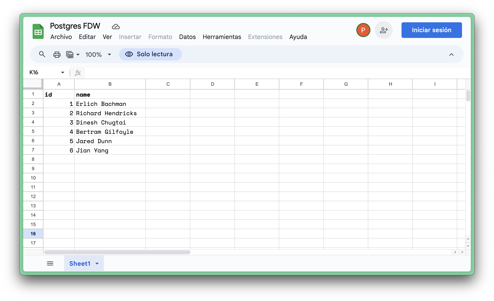

# Developing a Wasm Wrapper (Advanced)

If you followed the [Quick Start](create-wasm-wrapper.md), you should have:

1. Built a GitHub FDW
2. Installed it on Postgres
3. Used it to query GitHub events

This guide will show you how to develop the Wasm Wrapper locally to iterate faster. We will adapt GitHub wrapper and instead we will query a Google Sheet.

## Install pre-requisites

If you haven't already completed the [Quick Start](create-wasm-wrapper.md), do that first. For local development:

- install the [Supabase CLI](https://supabase.com/docs/guides/cli/getting-started) (version `>= 1.187.10` is needed).
- install [Docker](https://www.docker.com/get-started/)

## Create a Google Sheet

In this example, we're going to create a Wrapper that can query a Google Sheet.

1. Open [this](https://docs.google.com/spreadsheets/d/1OWi0x39w9FhVFP0EmSRRWWKkzhVXpYeTZJLmvaSKy-o/edit?gid=0#gid=0) Google Sheet.
2. Go to `File` > `Make a copy`
3. In your new Sheet, click `Share` (top right), and then change General Access to `Anyone with the link`.

You should have your own Google Sheet:



## Rename your Wrapper

Open `Cargo.toml` and update the Wrapper details:

```toml
[package]
name = "sheets_fdw" # The name of your wrapper. Must be Postgres compatible.
version = "0.3.0" # The version number.

[package.metadata.component]
package = "my-company:sheets-fdw" # A namespaced identifier
```

Open `wit/world.wit` and update the package name and version:

```
package my-company:sheets-fdw@0.3.0;
```

## Modify the source code

!!! tip

    You can refer to the Paddle [source code](https://github.com/supabase/wrappers/blob/main/wasm-wrappers/fdw/paddle_fdw/src/lib.rs) to help with your development.

We need to query the Google Sheet using the JSON API:

```bash
curl -L \
  'https://docs.google.com/spreadsheets/d/1OWi0x39w9FhVFP0EmSRRWWKkzhVXpYeTZJLmvaSKy-o/gviz/tq?tqx=out:json'
```

To do this, we need our Wrapper to accept a `sheet_id` instead of a GitHub `api_url`. The `sheet_id` can be found in above Google Sheet URL, in this example it is **`1OWi0x39w9FhVFP0EmSRRWWKkzhVXpYeTZJLmvaSKy-o`**.

Replace the `init()` function with the following code:

```rs title="src/lib.rs"
fn init(ctx: &Context) -> FdwResult {
    Self::init_instance();
    let this = Self::this_mut();

    // get API URL from foreign server options if it is specified
    let opts = ctx.get_options(OptionsType::Server);
    this.base_url = opts.require_or("base_url", "https://docs.google.com/spreadsheets/d");

    Ok(())
}
```

Replace the `begin_scan()` function with the following code, this function will be called before the foreign table is queried.

```rs title="src/lib.rs"
fn begin_scan(ctx: &Context) -> FdwResult {
    let this = Self::this_mut();

    // get sheet id from foreign table options and make the request URL
    let opts = ctx.get_options(OptionsType::Table);
    let sheet_id = opts.require("sheet_id")?;
    let url = format!("{}/{}/gviz/tq?tqx=out:json", this.base_url, sheet_id);

    // make up request headers
    let headers: Vec<(String, String)> = vec![
        ("user-agent".to_owned(), "Sheets FDW".to_owned()),
        // header to make JSON response more cleaner
        ("x-datasource-auth".to_owned(), "true".to_owned()),
    ];

    // make a request to Google API and parse response as JSON
    let req = http::Request {
        method: http::Method::Get,
        url,
        headers,
        body: String::default(),
    };
    let resp = http::get(&req)?;
    // remove invalid prefix from response to make a valid JSON string
    let body = resp.body.strip_prefix(")]}'\n").ok_or("invalid response")?;
    let resp_json: JsonValue = serde_json::from_str(body).map_err(|e| e.to_string())?;

    // extract source rows from response
    this.src_rows = resp_json
        .pointer("/table/rows")
        .ok_or("cannot get rows from response")
        .map(|v| v.as_array().unwrap().to_owned())?;

    // output a Postgres INFO to user (visible in psql), also useful for debugging
    utils::report_info(&format!(
        "We got response array length: {}",
        this.src_rows.len()
    ));

    Ok(())
}
```

Replace the `iter_scan()` function with the following code, this function will be called for each source row.

```rs title="src/lib.rs"
fn iter_scan(ctx: &Context, row: &Row) -> Result<Option<u32>, FdwError> {
    let this = Self::this_mut();

    // if all source rows are consumed, stop data scan
    if this.src_idx >= this.src_rows.len() {
        return Ok(None);
    }

    // extract current source row, an example of the source row in JSON:
    // {
    //   "c": [{
    //      "v": 1.0,
    //      "f": "1"
    //    }, {
    //      "v": "Erlich Bachman"
    //    }, null, null, null, null, { "v": null }
    //    ]
    // }
    let src_row = &this.src_rows[this.src_idx];

    // loop through each target column, map source cell to target cell
    for tgt_col in ctx.get_columns() {
        let (tgt_col_num, tgt_col_name) = (tgt_col.num(), tgt_col.name());
        if let Some(src) = src_row.pointer(&format!("/c/{}/v", tgt_col_num - 1)) {
            // we only support I64 and String cell types here, add more type
            // conversions if you need
            let cell = match tgt_col.type_oid() {
                TypeOid::I64 => src.as_f64().map(|v| Cell::I64(v as _)),
                TypeOid::String => src.as_str().map(|v| Cell::String(v.to_owned())),
                _ => {
                    return Err(format!(
                        "column {} data type is not supported",
                        tgt_col_name
                    ));
                }
            };

            // push the cell to target row
            row.push(cell.as_ref());
        } else {
            row.push(None);
        }
    }

    // advance to next source row
    this.src_idx += 1;

    // tell Postgres we've done one row, and need to scan the next row
    Ok(Some(0))
}
```

## Developing locally

We'll use the CLI to develop locally. This will be faster than the GitHub release workflow.

### Start Supabase

After the CLI is installed, start the Supabase services. If this is your first time it might take some time to download all the services.

```bash
supabase init # you only need to run this once
supabase start
```

### Build your wrapper

And then run the script to build the Wasm FDW package and copy it to Supabase database container:

```bash
./local-dev.sh
```

!!! tip

    You can also use it with [cargo watch](https://crates.io/crates/cargo-watch): `cargo watch -s ./local-dev.sh`

### Installing the wrapper

Visit SQL Editor in your [local browser](http://127.0.0.1:54323/project/default/sql/1), create foreign server and foreign table like below:

```sql
create extension if not exists wrappers with schema extensions;

create foreign data wrapper wasm_wrapper
  handler wasm_fdw_handler
  validator wasm_fdw_validator;

create server example_server
  foreign data wrapper wasm_wrapper
  options (
    -- use 'file://' schema to reference the local wasm file in container
    fdw_package_url 'file:///sheets_fdw.wasm',
    fdw_package_name 'my-company:sheets-fdw',
    fdw_package_version '0.3.0'
  );

create schema if not exists google;

create foreign table google.sheets (
  id bigint,
  name text
)
server example_server
options (
  -- replace sheet_id with yours
  sheet_id '1OWi0x39w9FhVFP0EmSRRWWKkzhVXpYeTZJLmvaSKy-o'
);
```

!!! NOTE

    The foreign server option `fdw_package_checksum` is not needed for local development.

Now you can query the foreign table like below to see result:

```sql
select
  *
from
  google.sheets
```

## Considerations

### Version compatibility

The Wasm FDW (guest) runs inside a Wasm runtime (host) which is provided by the [Wrappers Wasm FDW framework](https://github.com/supabase/wrappers/tree/main/wrappers/src/fdw/wasm_fdw). The guest and host versions need to be compatible. We can define the required host version in the guest's `host_version_requirement()` function like below:

```rust
impl Guest for ExampleFdw {
    fn host_version_requirement() -> String {
        "^0.1.0".to_string()
    }
}
```

Both guest and host are using [Semantic Versioning](https://docs.rs/semver/latest/semver/enum.Op.html). The above code means the guest is compatible with host version greater or equal `0.1.0` but less than `0.2.0`. If the version isn't comatible, the Wasm FDW cannot run on that version of host.

All the available host versions are listed [here](https://github.com/supabase/wrappers/blob/main/wrappers/src/fdw/wasm_fdw/README.md). When you develop your own Wasm FDW, always choose compatible host version properly.

### Security

!!! warning
    Never use untrusted Wasm FDW on your database.

Although we have implemented security measures and limited the Wasm runtime environment to a minimal interface, ultimately you are responsible for your data. Never install a Wasm FDW from untrusted source. Always use official sources, like [Supabase Wasm FDW](../catalog/wasm/index.md), or sources over which you have full visibility and control.

### Performance

The Wasm package will be dynamically downloaded and loaded to run on Postgres, so you should make sure the Wasm FDW is small to improve performance. Always build your project in `release` mode using the profile specified in the `Cargo.toml` file:

```toml
[profile.release]
strip = "debuginfo"
lto = true
```

```bash
# build in release mode and target wasm32-unknown-unknown
cargo component build --release --target wasm32-unknown-unknown
```

### Automation

If you host source code on GitHub, the building and release process can be automated, take a look at [the example CI workflow file](https://github.com/supabase-community/postgres-wasm-fdw/blob/main/.github/workflows/release_wasm_fdw.yml) for more details.

## Limitations

The Wasm FDW currently only supports data sources which have HTTP(s) based JSON API, other sources such like TCP based DBMS or local files are not supported.

Another limitation is that many 3rd-party Rust libraries don't support `wasm32-unknown-unknown` target, we cannot use them in the Wasm FDW project.

## Wrap up

When you're ready, you can follow the [Release process](../guides/create-wasm-wrapper.md#release-the-wasm-fdw-package) in the quickstart guide to release a new version of your wrapper.

## More examples

Some other Wasm foreign data wrapper projects developed by Supabase team:

- [Snowflake Wasm FDW](https://github.com/supabase/wrappers/tree/main/wasm-wrappers/fdw/snowflake_fdw)
- [Paddle Wasm FDW](https://github.com/supabase/wrappers/tree/main/wasm-wrappers/fdw/paddle_fdw)
